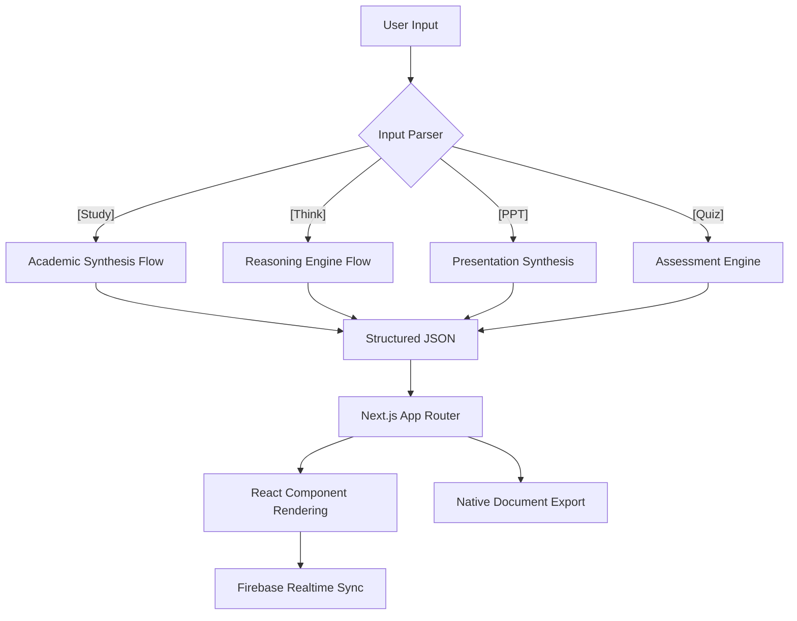

# DeciMindAI - 🧠 Next-Gen AI Study Assistant & Academic Automation

[](https://nextjs.org/)
[](https://www.typescriptlang.org/)
[](https://firebase.google.com/)
[](https://groq.com/)
[](https://tailwindcss.com/)

**DeciMindAI** is a premium, AI-orchestrated platform designed to bridge the gap between AI chat and academic productivity. It is a comprehensive ecosystem for students, researchers, and professionals to generate structured learning materials, professional documents, and interactive study tools in seconds.

---

## 🌐 1. Project Abstraction

**DeciMindAI** falls under the intersection of AI-native applications and productivity software, specifically focusing on **Natural Language Processing (NLP)** and **automated document synthesis**. 

Current AI platforms are fragmented—users must jump between tools for chat, OCR, presentation design, and document formatting. Generic AI models often provide "shallow" answers that don't meet university-level academic standards without complex prompt engineering. **DeciMindAI** solves this by understanding **academic hierarchies** and instantly rendering information into professional-grade formats like PPTX, PDF, and DOCX.

### 🎯 Project Objective
- **Automate the transition** from conceptual chat to finished academic assets.
- **Synthesize "13-mark" answers** compliant with university standards.
- **Generate real-time, editable presentations** from simple text prompts.
- **Integrate multimodal capabilities** (OCR for images/PDFs) for holistic study management.

---

## 🌟 2. Key Highlights & Features

### 📖 Study Mode (Academic Tutor)
Specifically engineered for college students, Study Mode transforms a simple query into a comprehensive academic asset.
- **Structure**: Generates "13 Marks Answers" including an Introduction, Core Body (numbered headings), Comparison Tables, and a Conclusion.
- **Flow Summary**: Every response includes a bulleted process flow for quick revision.
- **Trigger**: Wrap your prompt like `[Study: Explain Cloud Computing Architecture]`.

### 🧠 Think Mode (Reasoning Engine)
Focuses on the "Why" and "How" of complex problems.
- **Chain of Thought (CoT)**: Breaks down the AI's logic into step-by-step reasoning blocks.
- **Deep Context**: Ideal for system design, mathematical proofs, or philosophical analysis.
- **Trigger**: Wrap your prompt like `[Think: How do Neural Networks learn?]`.

### 📊 Interactive PPT Generator
A complete "Context-to-Creator" workflow.
- **Live Preview**: Real-time rendering of slides using **Embla Carousel**.
- **Native Export**: Downloads directly as a `.pptx` file using `pptxgenjs`.
- **Image Intelligence**: Automatically suggests image keywords for each slide.

### 📝 AI-Powered Quiz Engine
- **Customizable Assessment**: Set difficulty levels and question counts.
- **Visual Analytics**: Uses **Recharts** to provide a visual breakdown of your score.
- **Feedback Loop**: Analyzes weak areas and provides personalized study tips.

### 📄 Multimodal Document Hub
- **OCR Integration**: Powered by **OCR.space API** to extract text from handwritten notes or textbook images.
- **PDF Parsing**: Uses `pdf-parse` to ingest large documents for summarization.
- **Universal Export**: One-click download as PDF or DOCX.

---

## 🛠️ 3. Technical Architecture & System Design

### High-Level Processing Pipeline
DeciMindAI operates on a **"Context-to-Deliverable"** architecture.



### AI & Orchestration Layer
- **[Groq SDK](https://groq.com/)**: Leverages LPU™ (Language Processing Units) for sub-second inference (300+ tokens/sec).
- **[Google Genkit](https://firebase.google.com/docs/genkit)**: Orchestrates AI flows and manages structured data generation.
- **[Zod](https://zod.dev/)**: Ensures 100% schema accuracy for JSON outputs used in PPT and Quiz rendering.

### Database Schema (Firebase)
Hierarchical structure optimized for real-time synchronization.

```json
{
  "chats": {
    "USER_ID": {
      "CHAT_ID": {
        "title": "Quantum Mechanics 101",
        "createdAt": 1714210000000,
        "messages": {
          "MSG_ID": {
            "role": "assistant",
            "content": "...",
            "isStudyResponse": true,
            "pptData": { "title": "...", "slides": [] }
          }
        }
      }
    }
  }
}
```

---

## 💻 4. System Requirements

### **Software Requirements**
- **Operating System**: Windows 10/11, macOS, or Linux.
- **Language & Runtime**: Node.js (v18.x+), TypeScript.
- **Core Framework**: Next.js 15 (App Router).
- **Database**: Firebase Realtime Database.
- **AI Inference**: Groq SDK (Llama 3.3 70B Engine).
- **Document Engines**: PptxGenJS, JsPDF, Docx.js.

### **Hardware Requirements**
- **Processor**: Intel Core i5 (8th Gen) / AMD Ryzen 5 or better.
- **Memory (RAM)**: 8 GB Minimum (16 GB Recommended).
- **Internet**: High-speed broadband for real-time AI inference.
- **Server**: Vercel Edge Network with Groq LPU acceleration.

---

## 📁 5. Project Structure

```text
src/
├── ai/                 # Genkit flows and AI logic
│   ├── flows/          # Structured chat and study flows
│   └── genkit.ts       # Genkit configuration
├── app/                # Next.js App Router (Pages & APIs)
│   ├── api/            # Serverless functions (PPT, Quiz, OCR)
│   ├── chat/           # Dynamic chat interface
│   └── ppt-mode/       # Interactive presentation mode
├── components/         # Reusable UI components
│   ├── ui/             # Shadcn-based visual components
│   └── blocks/         # Complex UI blocks (Sidebar, Header)
├── hooks/              # Custom React hooks (Auth, Toasts)
├── lib/                # Utility functions (Firebase, Exports)
└── types/              # TypeScript definitions
```

---

## ⚙️ 6. Setup & Installation

1. **Clone the Repository**:
   ```bash
   git clone https://github.com/sasikumarmcadev/DeciMindAI.git
   ```
2. **Install Dependencies**:
   ```bash
   npm install
   ```
3. **Configure Environment Variables**:
   Create a `.env.local` file:
   ```env
   GROQ_API_KEY=your_groq_key
   OCR_API_KEY=your_ocr_space_key
   NEXT_PUBLIC_FIREBASE_API_KEY=...
   NEXT_PUBLIC_FIREBASE_AUTH_DOMAIN=...
   NEXT_PUBLIC_FIREBASE_DATABASE_URL=...
   NEXT_PUBLIC_FIREBASE_PROJECT_ID=...
   ```
4. **Run Development Server**:
   ```bash
   npm run dev
   ```
   Access at `http://localhost:9003`.

---

## 📜 7. Academic Context

### Journal Paper Initiation
**Title**: *DeciMindAI: Overcoming the Creator Gap in Academic Workflows using LLM-based Automated Asset Generation.*
**Focus**: Exploration of multi-format document orchestration, using structured JSON output from Llama 3.3 to drive concurrent rendering of UIs, presentations, and documents.

### Future Roadmap
- **Collaboration**: Real-time multi-user document editing.
- **Voice-to-Slide**: Voice-controlled presentation generation.
- **Math Engine**: LaTeX integration for advanced mathematical rendering.

---

## 👨‍💻 Developed By

**Sasikumar**
- **Education**: PG MCA, Rathinam Technical Campus, Coimbatore.
- **Expertise**: AI Systems, Full-Stack Development.
- **Links**: [Portfolio](https://www.sasikumar.in) | [GitHub](https://github.com/sasikumarmcadev) | [LinkedIn](https://www.linkedin.com/in/sasikumarmca)

---

> [!TIP]
> This README serves as a comprehensive technical guide and a foundation for academic project documentation (Chapters 3 & 4 of standard theory reports).